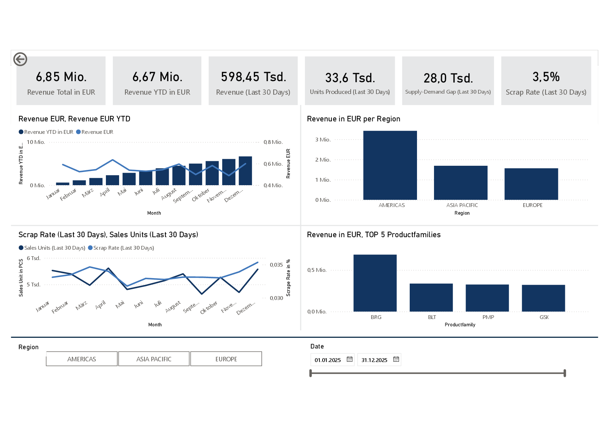
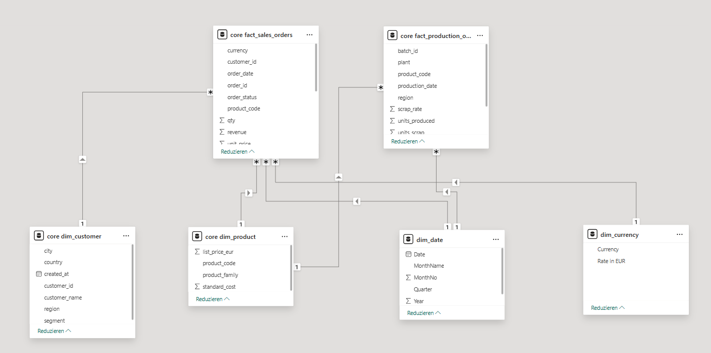

# Manufacturing Analytics Pipeline

End-to-end analytics pipeline for a manufacturing use case: raw ingestion → PostgreSQL (raw/core) → star schema → Power BI dashboard.

**Tech:** PostgreSQL · SQL · Python · Power BI

##Dashboard Overview

This project demonstrates an end-to-end analytics pipeline for a global manufacturing company, covering the full workflow from raw data ingestion to business-ready dashboards.

The goal of this project is to showcase practical skills in data ingestion, SQL-based data modeling, analytics engineering, and business-oriented reporting with Power BI.

The pipeline processes sales and production data, stores it in PostgreSQL using a star schema, and visualizes key KPIs in an executive dashboard.

##Architecture Overview

The data flow follows a clear layered architecture.

Raw CSV files are loaded into PostgreSQL and stored unchanged in a raw schema.
SQL-based transformations populate a core schema with dimension and fact tables.
Power BI connects to the core schema and uses a star schema for reporting and time intelligence.

Key design principles are auditability of raw data, reproducible SQL transformations, a clean analytical data model, and centralized time handling via a date dimension.

##Data Model (Star Schema)

The data model follows a star schema with two fact tables and shared dimensions. 

##Dimension Tables

dim_customer contains customer attributes such as region, country, city, and segment.
dim_product contains product and product family information.
dim_date is a calendar table used for time intelligence such as YTD and rolling windows.

##Fact Tables

fact_sales_orders stores order-level sales data including revenue, quantity, currency, and order date.
fact_production_output stores production data including units produced, scrap units, plant, and production date.

This star schema enables efficient slicing and filtering by time, region, product, and customer.

##Key KPIs and Analytics

Sales Performance KPIs include total revenue in EUR, revenue year-to-date, revenue for the last 30 days, revenue by region, and top 5 product families by revenue.

Production and quality KPIs include units produced in the last 30 days, sales units in the last 30 days, supply-demand gap in the last 30 days, and scrap rate in the last 30 days calculated as a weighted ratio.

Time intelligence features include YTD calculations, rolling 30-day metrics, and an interactive date range slicer based on the date dimension.

##Dashboard

The Power BI dashboard is designed as an executive overview and follows a clear storytelling approach.
It starts with overall performance KPIs, followed by revenue trends over time, regional revenue distribution, production efficiency and quality metrics, and product portfolio performance.

The dashboard is built on a clean star schema and responds dynamically to slicers and filters.

##Technology Stack

Python is used for data loading and pipeline orchestration.
PostgreSQL is used for data storage and SQL-based transformations.
SQL is used for data modeling and business logic.
Power BI is used for visualization and reporting.
Git is used for version control.

How to Run the Project Locally

##Prerequisites

PostgreSQL must be installed and running.
Python version 3.9 or higher is required.
Power BI Desktop is required for visualization.

##Clone the Repository

Clone the repository from GitHub and navigate into the project directory.

##Python Setup

Install the required Python packages using the requirements file.
Create a .env file based on .env.example and provide PostgreSQL connection details.

##Run the Pipeline

Execute the pipeline script to load raw data, run SQL transformations, and populate the core schema.

##Power BI

Connect Power BI to PostgreSQL, load tables from the core schema, create relationships according to the star schema, and open or recreate the dashboard.

##Data Quality and Assumptions

Raw input data may contain inconsistent date formats and currencies.
Data cleaning and normalization are handled during SQL transformations.
Currency conversion uses a static exchange rate table for demonstration purposes.
Scrap rate is calculated as a weighted ratio rather than a simple average.

##What This Project Demonstrates

This project demonstrates end-to-end analytics thinking, separation of raw and transformed data layers, strong SQL and data modeling fundamentals, practical Power BI time intelligence, and business-focused KPI design.

##Possible Next Steps

Possible extensions include adding prior-year data for YoY analysis, automating pipeline execution, implementing incremental loads, extending currency handling with historical exchange rates, and deploying the solution to a cloud environment.

##Contact

For questions or feedback, feel free to reach out via GitHub.
